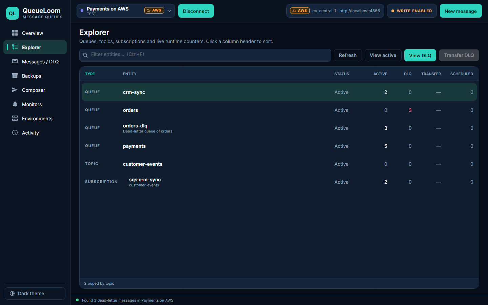

# QueueLoom

A desktop app for Windows, macOS and Linux for message queues in **Azure Service Bus**, **Amazon SQS / SNS** and **Google Cloud Pub/Sub**. Browse queues, topics and subscriptions, find messages in dead-letter queues, and back up, delete, resend or restore them safely. AI assistants (Claude, Cursor, VS Code) can use it too, through MCP.


<table>
  <tr>
    <td></td>
    <td></td>
    <td></td>
  </tr>
  <tr>
    <td align="center">Environments in three clouds</td>
    <td align="center">Add environment</td>
    <td align="center">SQS queues and SNS topics</td>
  </tr>
</table>

## Install

Download the package for your system from [Releases](../../releases). No .NET installation is needed.

| System | Package | Start |
|---|---|---|
| Windows | `QueueLoom-<version>-win-x64.zip` | unzip, run `QueueLoom.exe` |
| macOS (Apple silicon / Intel) | `QueueLoom-<version>-osx-arm64.zip` / `-osx-x64.zip` | unzip, move `QueueLoom.app` to Applications; the first time, right-click it → **Open** (the app is not notarized by Apple) |
| Linux | `QueueLoom-<version>-linux-x64.tar.gz` | `tar -xzf` it, run `./QueueLoom`; `./install-desktop-entry.sh` adds it to the application menu |

## Getting started

1. **Environments** → **Add environment**. Pick the service and sign in:
   - **Azure Service Bus**: Microsoft Entra ID or a connection string.
   - **Amazon SQS / SNS**: a region and an access key, or your AWS profile.
   - **Google Cloud Pub/Sub**: a project ID and a service account key, or `gcloud` default credentials.
2. Choose the environment in the top bar and press **Connect**.
3. **Explorer** shows every queue, topic and subscription with live counters. Select one and press **View DLQ** or **View active**.

The badge next to each environment (**AZURE**, **AWS**, **GCP**) shows its cloud, and the coloured dot shows its stage: dev, test or prod. The connected environment's cloud and namespace, region or project are always visible in the top bar.

## What you can do

- **Find dead letters.** On **Messages / DLQ**, search by Message ID, Correlation ID, subject, body text or a property, optionally only from the last hour, day or week. **Save search** keeps a search to run again with one click.
- **Delete only the messages you need.** Tick the found messages and press **Delete N messages…**; the others stay in the queue.
- **Resend.** Tick messages and press **Resend N messages…**: back to where they came from or to any queue or topic, as **copies** (the originals stay) or as a **move** (sent first, then the originals are backed up and removed from the DLQ). In **Composer**, **Open as draft** lets you edit one message before sending it the same two ways.
- **Read packed bodies.** Bodies compressed with gzip, encoded as base64, written as Avro files or as Protobuf open on a **Decoded** tab next to **Body**, with the steps shown (for example *base64 → gzip → JSON*). Protobuf fields are shown by number, since QueueLoom has no .proto file.
- **Export** the ticked or listed messages to JSON or CSV.
- **Empty a dead-letter queue**, with a limit on how many messages to remove.
- **Restore from backups** or replay copies to any queue or topic. On **Backups**, pick a group on the left (an environment, a topic with its subscriptions, a subscription or a queue) and delete all its backups at once, or keep backups for a set number of days.
- **Watch dead-letter counts** on **Monitors** while the app is open. New dead letters can also show a system notification and post to a Slack or Microsoft Teams webhook.
- **Session-enabled** Azure queues and subscriptions work too: their dead letters like any other, their active messages session by session.
- **Scheduled and deferred** Azure messages are marked in the list of active messages, with the time a scheduled one is due. Tick them (or click **Scheduled** or **Deferred** above the list) to cancel or remove them; each is backed up first.

QueueLoom never deletes anything without a local backup, and it asks for confirmation first. Production environments are read-only until you press **Unlock 10 min** and type the environment name.

## How AWS and Google Cloud look in QueueLoom

| | Amazon SQS / SNS | Google Cloud Pub/Sub |
|---|---|---|
| Queues | SQS queues | none |
| Topics and subscriptions | SNS topics and their subscriptions | topics and subscriptions |
| Dead-letter queue | the queue in the redrive policy | a subscription on the dead-letter topic |
| Counters | approximate, from SQS | from Cloud Monitoring (needs the Monitoring Viewer role); otherwise dead letters are counted when you scan |

SQS and Pub/Sub cannot peek. To show messages, QueueLoom receives them and hands them back unchanged a moment later. This counts as one more receive (SQS) or delivery attempt (Pub/Sub), and in SQS FIFO queues it shows up to 10 messages per message group. For local testing, set the endpoint to [LocalStack](https://localstack.cloud) (`http://localhost:4566`) or the Pub/Sub emulator (`localhost:8085`).

## Keyboard shortcuts

| Keys | Action |
|---|---|
| Ctrl+1 … Ctrl+8 | Switch pages |
| Ctrl+F | Search on the current page |
| Ctrl+R | Refresh counters |
| Ctrl+N | New message |
| Ctrl+Shift+F | Format JSON |
| Esc | Cancel the running operation |

Right-click a row to copy a name or ID. Click a column header in Explorer to sort by it.

## Connect an AI assistant (MCP)

QueueLoom can act as an [MCP](https://modelcontextprotocol.io) server, so an assistant can look into your queues for you. For example, you can ask: *"Which queues in Staging have dead letters? Find the ones about order 1042 and delete them."*

**1. Copy the configuration.** In QueueLoom, open **Overview** → **AI assistants (MCP)** → **Copy configuration**. It already contains the right path to the app:

```json
{
  "mcpServers": {
    "queueloom": {
      "command": "C:\\Tools\\QueueLoom\\QueueLoom.exe",
      "args": ["--mcp"]
    }
  }
}
```

**2. Paste it into your assistant:**
- **Claude Desktop:** Settings → Developer → Edit Config, then restart Claude.
- **Cursor:** `~/.cursor/mcp.json`
- **VS Code:** `.vscode/mcp.json`, using `"servers"` instead of `"mcpServers"`.
- **Claude Code:** `claude mcp add queueloom -- "C:\Tools\QueueLoom\QueueLoom.exe" --mcp`

**What the assistant may do:**
- **Read freely:** list environments and queues, scan and search dead letters, view messages, and export them to a JSON or CSV file (saved in the `exports` folder of the data folder). Reading never removes anything.
- **Change only with your approval:** delete messages, empty a dead-letter queue, resend dead letters (as copies or as a move) or send a message. QueueLoom shows you this window, and nothing happens until you press **Approve**:


Add `"--read-only"` to `args` if the assistant should never be able to change anything.

> Messages the assistant reads are sent to your AI provider. Use `--read-only`, or skip MCP, for data that must stay on your machine.

## Where data is stored

Backups are saved in the `backups` folder next to `QueueLoom.exe` (on Linux and macOS, next to the program file). If that folder cannot be written, for example under Program Files, they go to the data folder instead. Settings, encrypted credentials and logs are kept in `%LOCALAPPDATA%\QueueLoom` (`~/.local/share/QueueLoom` on Linux, `~/Library/Application Support/QueueLoom` on macOS). Backups contain message bodies in plain text.

---

Build from source: `dotnet test QueueLoom.slnx` (.NET 10 SDK). Tests against LocalStack, the Pub/Sub emulator and the Service Bus emulator run when `QUEUELOOM_LOCALSTACK_URL`, `QUEUELOOM_PUBSUB_EMULATOR` and `QUEUELOOM_SERVICEBUS_EMULATOR` are set. · [MIT License](LICENSE) · [Third-party notices](THIRD-PARTY-NOTICES.md)
