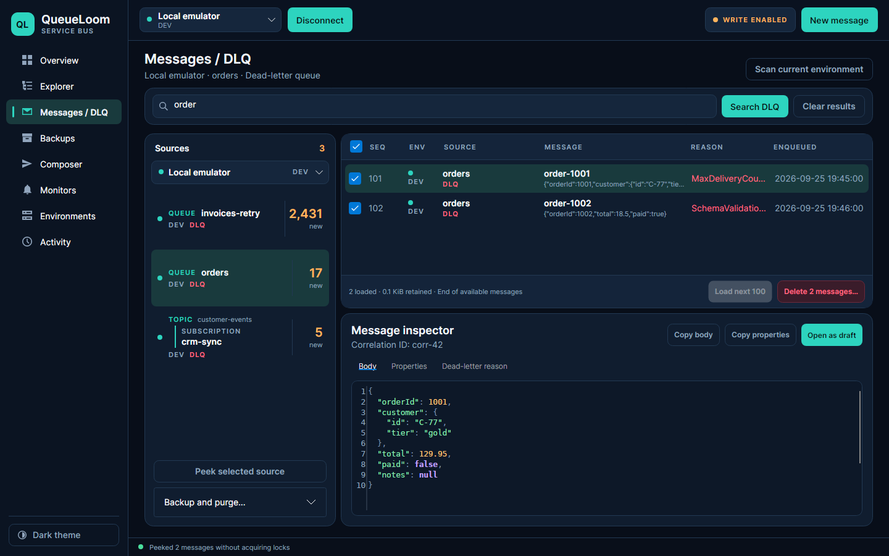
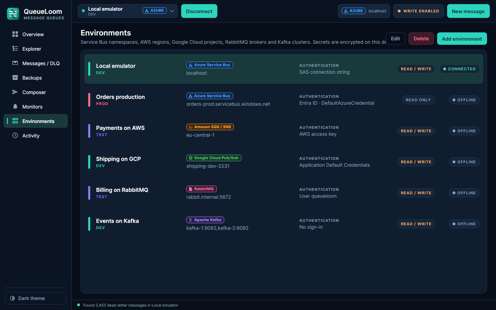
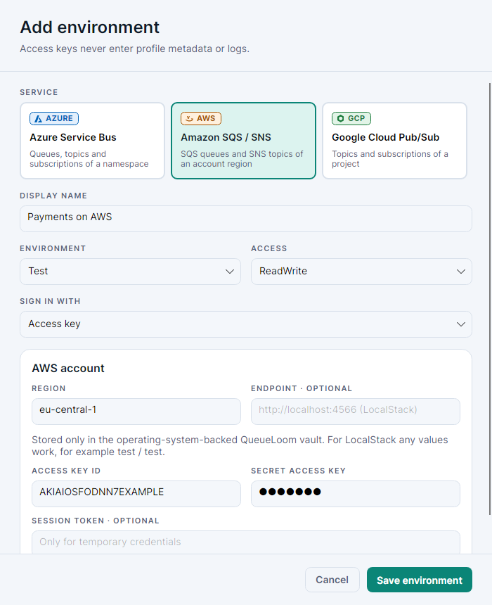
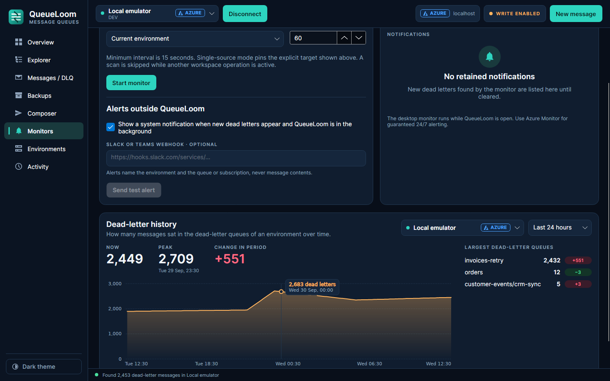
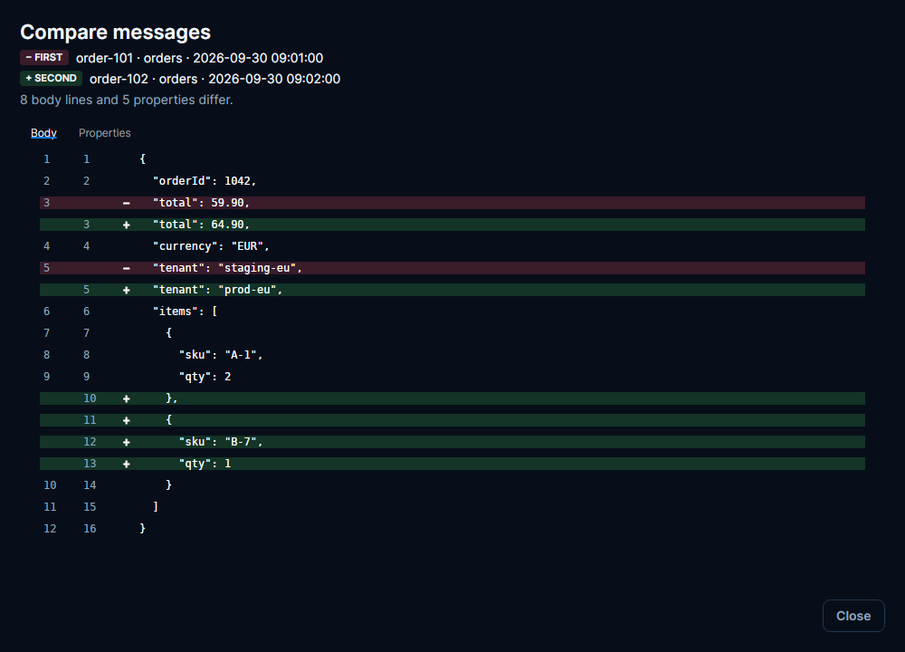
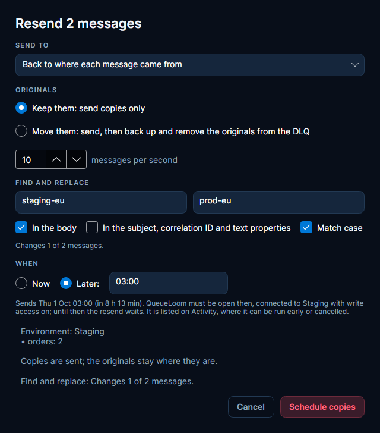
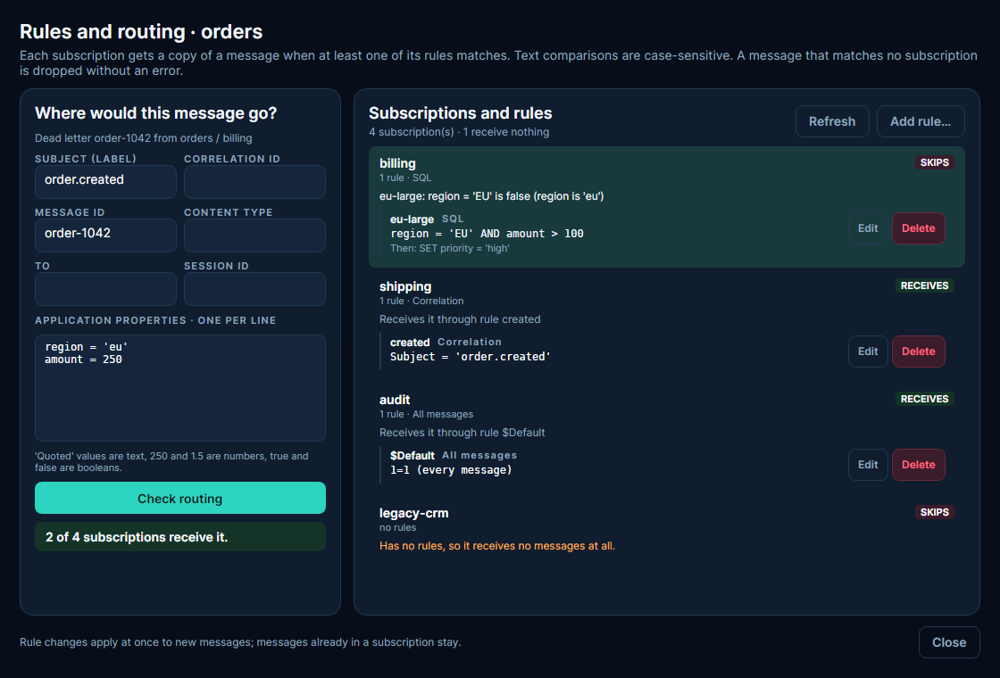
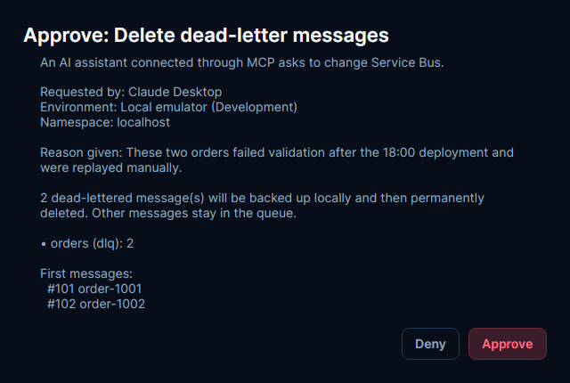

# QueueLoom

A desktop app for Windows, macOS and Linux for message queues in **Azure Service Bus**, **Amazon SQS / SNS**, **Google Cloud Pub/Sub**, **RabbitMQ** and **Apache Kafka**. Browse queues, topics and subscriptions, find messages in dead-letter queues, and back up, delete, resend or restore them safely. AI assistants (Claude, Cursor, VS Code) can use it too, through MCP.



<table>
  <tr>
    <td></td>
    <td></td>
    <td></td>
  </tr>
  <tr>
    <td align="center">Environments in five services</td>
    <td align="center">Add environment</td>
    <td align="center">Dead-letter history</td>
  </tr>
  <tr>
    <td></td>
    <td></td>
    <td></td>
  </tr>
  <tr>
    <td align="center">Compare two messages</td>
    <td align="center">Find and replace, resend later</td>
    <td align="center">Rules and routing</td>
  </tr>
</table>

## Install

Download the package for your system from [Releases](../../releases). No .NET installation is needed. When a new version comes out, QueueLoom offers to update itself: it downloads the package, checks its SHA-256 checksum, installs it and restarts.

The packaged `QueueLoom` executable is a stable launcher. Updates add verified application versions and
activation records beside the installation, preserving the launch path and previous confirmed versions.
Keep the bootstrap files and version store with the launcher. Protocol v1 retains committed versions;
see [launcher recovery, migration and manual launcher updates](docs/stable-launcher.md) for storage and
first-upgrade limits. Your preferences, credentials and backups stay outside replaceable payloads.

Each package is signed with a [GitHub artifact attestation](https://docs.github.com/actions/security-for-github-actions/using-artifact-attestations/using-artifact-attestations-to-establish-provenance-for-builds) (Sigstore, no private key involved). It proves that the package was built by this repository's release workflow from the tagged commit. To check a download with the [GitHub CLI](https://cli.github.com/):

```
gh attestation verify QueueLoom-<version>-<platform>.zip --repo bitcodepro/QueueLoom
```

The built-in updater checks the SHA-256 checksum published with the release. It does not verify the attestation itself.

The update dialog distinguishes checksum fetch, download, verification, extraction, installation and recovery. **Retry update** appears only after a failure known to permit a fresh attempt. Repeated clicks and stale progress are ignored; installation cannot be cancelled halfway through replacement. Update now requests an automatic restart, with restart controls available as a fallback. The previous files are retained until startup is acknowledged. Recovery that cannot verify the recorded backups retains its receipt and reports the failure instead of claiming that the old version was restored.

| System | Package | Start |
|---|---|---|
| Windows | `QueueLoom-<version>-win-x64.zip` | unzip, run `QueueLoom.exe` |
| macOS (Apple silicon / Intel) | `QueueLoom-<version>-osx-arm64.zip` / `-osx-x64.zip` | unzip, move `QueueLoom.app` to Applications; the first time, right-click it → **Open** (the app is not notarized by Apple) |
| Linux | `QueueLoom-<version>-linux-x64.tar.gz` | `tar -xzf` it, run `./QueueLoom`; `./install-desktop-entry.sh` adds it to the application menu |

## Getting started

1. **Environments** → **Add environment**. Pick the service and sign in:
   - **Azure Service Bus**: Microsoft Entra ID or a connection string.
   - **Amazon SQS / SNS**: a region and an access key, or your AWS profile.
   - **Google Cloud Pub/Sub**: a project ID and a service account key, or `gcloud` default credentials.
   - **RabbitMQ**: host, virtual host, user and password. The management plugin must be on (it lists the queues).
   - **Apache Kafka**: bootstrap servers, with or without TLS and SASL, and optionally a Schema Registry.
2. Choose the environment in the top bar and press **Connect**.
3. **Explorer** shows every queue, topic and subscription with live counters. Select one and press **View DLQ** or **View active**.

The badge next to each environment (**AZURE**, **AWS**, **GCP**, **RABBITMQ**, **KAFKA**) shows its service, and the coloured dot shows its stage: dev, test or prod. The connected environment's service and namespace, region, project, host or cluster are always visible in the top bar.

## What you can do

RabbitMQ permits browsing, Copy and backed-up source purges. Selected deletion and Move are unavailable because application Message IDs can repeat and delivery tags cannot identify a previously reviewed delivery after it is returned to the queue.

- **Find dead letters.** On **Messages / DLQ**, search by Message ID, Correlation ID, subject, body text or a property, optionally only from the last hour, day or week. `/regex/` searches with a regular expression (`/…/i` ignores case), and `$.order.status == 'failed'` checks a field of the JSON body, also when it is gzip or base64 (`!=`, `>`, `<`, `=~ /regex/`, the path alone for "has the field", `[*]` for any list item, `and` / `or`). **Save search** keeps a search to run again with one click. For large dead-letter queues, tick **Deep**: it reads up to 20,000 messages per queue and can take a few minutes.
- **See why they failed.** Above the list, **REASONS** counts the found messages by dead-letter reason, and **CAUSES** splits a reason by what the error says, with IDs and numbers left out (for example *Order {n} was not found · 412*). Click one to tick exactly those messages.
- **Delete only the messages you need.** Tick the found messages and press **Delete N messages…**; the others stay in the queue.
- **Resend.** Tick messages and press **Resend N messages…**: back to where they came from or to any queue or topic, as **copies** (the originals stay) or as a **move** (sent first, then the originals are backed up and removed from the DLQ). **Find and replace** changes text in the bodies and text properties of all of them before they go, for example a wrong tenant or URL. **Later** sends them at a set time (*30m*, *2h*, *03:00*); scheduled resends are listed on **Activity**, where they can be run early or cancelled, and they run while QueueLoom is open, connected to their environment with write access on. In **Composer**, **Open as draft** lets you edit one message before sending it the same two ways. Azure and AWS moves require distinct new Message IDs because Azure or SQS/SNS FIFO duplicate detection can accept a preserved ID while suppressing the replacement. Use **Copy** to preserve IDs and keep the originals.
- **Compare two messages.** Tick any two listed messages (active, scheduled, deferred or dead-lettered) and press **Compare 2** to see which body lines and properties differ. Ticking an active message only selects it for comparing or exporting: **Delete** and **Resend** stay available only when every ticked message is one they apply to.
- **Read packed bodies.** Bodies compressed with gzip, encoded as base64, written as Avro files or as Protobuf open on a **Decoded** tab next to **Body**, with the steps shown (for example *base64 → gzip → JSON*). Protobuf fields are shown by number until you press **Load .proto files…** on the **Decoded** tab and pick a .proto file (every .proto in its folder is read) or a descriptor set from `protoc --descriptor_set_out`; the message type comes from the content type (`messageType=…`) or a `messageType` property, or else the loaded type that fits the body. Kafka messages written by Confluent serializers are decoded with their schema from the environment's Schema Registry, Protobuf ones with field names.
- **Export** the ticked or listed messages to JSON or CSV.
- **Empty a dead-letter queue** with **Backup and purge**, with a limit on how many messages to remove.
- **Restore from backups** or replay copies to any queue or topic. On **Backups**, pick a group on the left (an environment, a topic with its subscriptions, a subscription or a queue) and delete all its backups at once, or keep backups for a set number of days.
- **Review resend and replay history.** On **Activity**, choose an operation to browse its saved item outcomes. Tick **Pending** items and choose **Continue unattempted**, or tick **Rejected** items and choose **Retry proven failures**. Each recovery requires confirmation and the original environment/configuration with write access. A confirmed send is never resent, including a move whose source deletion failed. Unknown send/deletion outcomes require manual inspection; QueueLoom makes no universal exactly-once guarantee. Generic SDK errors remain uncertain because an earlier internal retry may have been accepted. Only an explicit provider-proven rejection can authorize Retry; RabbitMQ's mandatory unroutable return supplies that proof, so repairing its binding enables retry of the same saved item. Failed attempts retain the configured throttle. Purge and standalone deletion retain their existing Activity records and do not offer this send recovery workflow.
- **Browse large backups without loading bodies.** Listing uses a rebuildable metadata cache and bounded streaming reads of legacy files. Press **Open message** to load the selected body; switching rows cancels or discards a stale load. The original JSON backups retain full fidelity. The metadata scan accepts files up to 512 MiB with at most 256 KiB of metadata; the body viewer accepts files up to 64 MiB. Replay remains limited to 1,000 items and 32 MiB of actual bodies. Cache errors never invalidate the backup or authorize message deletion.
- **Clear the Activity view.** **Clear Activity view…** saves a reversible cutoff and hides older entries. Newer entries remain visible; **Restore Activity view** shows retained recent records. This action retains Activity journal files, operation/retry history, schedules, backups and message data. Activity records and finished operations are still deleted after 3 days (see [Where data is stored](#where-data-is-stored)).
- **Watch dead-letter counts** on **Monitors** while the app is open. New dead letters can also show a system notification and post to a Slack or Microsoft Teams webhook. The **Dead-letter history** chart shows how the count changed over the last 6 hours to 30 days, with the peak and the queues that grew; every monitor check and scan is recorded. With **Keep running in the system tray** on, closing the window leaves QueueLoom in the tray, so monitors and scheduled resends go on.
- **See who reads.** Explorer and Monitors show how many consumers a RabbitMQ queue has, and how far each Kafka consumer group is behind (its lag).
- **Manage queues** (optional). Turn on **Allow creating, changing and deleting queues** for an environment, and **Explorer** → **Manage** creates a queue with its dead-letter queue, changes its settings (time to live, deliveries before dead-lettering, lock) or deletes it. For Pub/Sub it does the same for subscriptions: select a topic to add one. Deleting asks you to type the name.
- **Share environments.** **Environments** → **Export…** saves every environment's settings to a file, without passwords, keys or connection strings; **Import…** adds them on another computer, read-only until you unlock them.
- **Find out where messages go.** A subscription receives only what its filter lets through, and a message no subscription takes is dropped without an error. **Explorer** → **Rules…** on a topic lists what decides it: Azure Service Bus SQL and correlation rules (values are compared case-sensitively, property names are not), Amazon SNS filter policies, Google Pub/Sub filters, or the bindings of a RabbitMQ exchange (direct, topic, headers and fanout, bindings to other exchanges and the alternate exchange). **Check routing** on a message, or on a draft in **Composer**, shows which subscriptions would receive it and, for the others, which comparison failed (for example *region = 'EU' is false (region is 'eu')*). With queue management allowed, Service Bus rules, SNS filter policies and RabbitMQ bindings can be added, changed and deleted there too; Pub/Sub fixes a filter when the subscription is created.
- **Follow auto-forwarding** (Azure Service Bus). Queues and subscriptions that forward say where to in **Explorer**, with the whole chain (*inbox → orders → eu-orders*) and who forwards to them; loops, chains longer than the 4 forwards Service Bus allows, and targets that do not exist are pointed out.
- **Session-enabled** Azure queues and subscriptions work too: their dead letters like any other, their active messages session by session.
- **Scheduled and deferred** Azure messages are marked in the list of active messages, with the time a scheduled one is due. Tick them (or click **Scheduled** or **Deferred** above the list) to cancel or remove them; each is backed up first.

QueueLoom never deletes anything without a local backup, and it asks for confirmation first. Production environments are read-only until you press **Unlock 10 min** and type the environment name.

## How the other services look in QueueLoom

| | Amazon SQS / SNS | Google Cloud Pub/Sub | RabbitMQ | Apache Kafka |
|---|---|---|---|---|
| Queues | SQS queues | none (subscriptions are managed instead) | queues | topics |
| Topics | SNS topics and their subscriptions | topics and subscriptions | exchanges (the subject is the routing key) | none |
| Dead-letter queue | the queue in the redrive policy | a subscription on the dead-letter topic | the queue the dead-letter exchange routes to | the topic with a dead-letter ending, for example `orders.DLT` |
| Counters | approximate, from SQS | from Cloud Monitoring (needs the Monitoring Viewer role); otherwise counted when you scan | ready messages, from the management plugin | messages the topic still keeps |

SQS, Pub/Sub and RabbitMQ cannot peek. To show messages, QueueLoom receives them and hands them back unchanged a moment later. This counts as one more receive (SQS) or delivery attempt (Pub/Sub, with a dead-letter policy); in RabbitMQ the message is marked as redelivered, and quorum queues on RabbitMQ 4.2 and earlier count it towards their delivery limit (4.3 and later do not). Explorer and **Messages / DLQ** show this as a warning next to the browse actions, with the queue's maximum receives or delivery attempts when QueueLoom knows them, because a message you look at often enough can be moved to the dead-letter queue. In SQS FIFO queues it shows up to 10 messages per message group.

SQS source-scoped dead-letter reads and deletion require an exact `DeadLetterQueueSourceArn`. Missing or empty attributes do not establish an origin: those messages stay in the physical DLQ and are excluded from source-scoped backups and settlement, including with emulators that omit the attribute. Open the physical SQS queue as an active queue to review unassigned messages; shared-DLQ counts cover the whole queue and can exceed the attributed rows. SNS subscription-scoped DLQ operations are blocked because the originating subscription cannot be identified.

Kafka keeps messages after they are read, so QueueLoom reads them by offset, without a consumer group. Above the list you choose where reading starts: the oldest messages, the newest, a time (*2026-09-30 14:00*, or *2h* ago) or an offset (*1500*, or *2:1500* for partition 2); **Load next 100** continues from there. Kafka cannot delete single messages: **Delete** and **move** are not offered there, but **Backup and purge** still backs up and deletes the messages of a dead-letter topic.

For local testing, point an environment at [LocalStack](https://localstack.cloud) (`http://localhost:4566`), the Pub/Sub emulator (`localhost:8085`), a `rabbitmq:4-management` container or an `apache/kafka` container.

## Keyboard shortcuts

| Keys | Action |
|---|---|
| Ctrl+1 … Ctrl+8 | Switch pages |
| Ctrl+F | Search on the current page |
| Ctrl+R | Refresh counters |
| Ctrl+N | New message |
| Ctrl+Shift+F | Format JSON |
| Esc | Cancel the running operation |

Right-click a row to copy a name or ID. Click a column header in Explorer to sort by it.

## Connect an AI assistant (MCP)

QueueLoom can act as an [MCP](https://modelcontextprotocol.io) server, so an assistant can look into your queues for you. For example, you can ask: *"Which queues in Staging have dead letters? Find the ones about order 1042 and delete them."*

**1. Copy the configuration.** In QueueLoom, open **Overview** → **AI assistants (MCP)** → **Copy configuration**. It already contains the right path to the app:

```json
{
  "mcpServers": {
    "queueloom": {
      "command": "C:\\Tools\\QueueLoom\\QueueLoom.exe",
      "args": ["--mcp"]
    }
  }
}
```

**2. Paste it into your assistant:**
- **Claude Desktop:** Settings → Developer → Edit Config, then restart Claude.
- **Cursor:** `~/.cursor/mcp.json`
- **VS Code:** `.vscode/mcp.json`, using `"servers"` instead of `"mcpServers"`.
- **Claude Code:** `claude mcp add queueloom -- "C:\Tools\QueueLoom\QueueLoom.exe" --mcp`

**What the assistant may do:**
- **Read freely:** list environments and queues, scan and search dead letters, view messages, group dead letters by cause (*why do messages pile up in orders?*), see how dead letters changed over the last hours or days, check which subscriptions of a topic (or queues of a RabbitMQ exchange) a message would reach, follow Azure auto-forwarding, and export messages to a JSON or CSV file (saved in the `exports` folder of the data folder). QueueLoom never removes anything when it reads. One exception asks you first: reading live (not dead-lettered) messages on SQS, Pub/Sub or RabbitMQ, because those services count every read as a delivery. A redrive or dead-letter policy can then move the messages, or drop them where no dead-letter target is set (for example a RabbitMQ quorum queue past its delivery limit, 20 by default since RabbitMQ 4.0, without a dead-letter exchange).
- **Change only with your approval:** delete messages, empty a dead-letter queue, resend dead letters (as copies or as a move) or send a message. Creating and deleting queues is not available to assistants. QueueLoom shows you this window, and nothing happens until you press **Approve**:



Add `"--read-only"` to `args` if the assistant should never be able to change anything.

> Messages the assistant reads are sent to your AI provider. Use `--read-only`, or skip MCP, for data that must stay on your machine.

## Where data is stored

Backups are saved in the `backups` folder next to the executable on Windows and Linux, or next to `QueueLoom.app` on macOS. macOS updates preserve older backups stored inside the bundle in that external folder. If the default folder cannot be written, for example under Program Files, backups go to the data folder instead. `QUEUELOOM_BACKUP_DIRECTORY` selects a custom folder; a path inside a macOS bundle is relocated under the external `backups/bundle-custom` folder. Settings, encrypted credentials, scheduled resends and logs are kept in `%LOCALAPPDATA%\QueueLoom` (`~/.local/share/QueueLoom` on Linux, `~/Library/Application Support/QueueLoom` on macOS). Backups contain message bodies in plain text.

When this version starts with older backups still inside its macOS bundle, it copies them to the selected external backup folder and keeps the originals. Before replacing an older bundle manually in Finder or from a DMG, move `QueueLoom.app/Contents/MacOS/backups` (and any custom backup folder inside the bundle) outside the bundle first. An application cannot recover files that Finder has already deleted while replacing it.

Activity records and the resend/replay history on **Activity** (which holds copies of the message bodies) are kept for **3 days** and then deleted automatically: when QueueLoom starts, and once a day while it keeps running. An operation that is not finished is kept until it is: items still pending, rejected, or with an unknown send or deletion outcome, a move that stopped before removing its originals, or a scheduled resend that has not started yet. Those can still be continued, retried or inspected. Backups and scheduled resends are not affected; backups have their own setting on **Backups**.

---

Build from source: `dotnet test QueueLoom.slnx` (.NET 10 SDK). Tests against LocalStack, the Pub/Sub emulator, the Service Bus emulator, RabbitMQ and Kafka run when `QUEUELOOM_LOCALSTACK_URL`, `QUEUELOOM_PUBSUB_EMULATOR`, `QUEUELOOM_SERVICEBUS_EMULATOR`, `QUEUELOOM_RABBITMQ` (host:port) and `QUEUELOOM_KAFKA` are set. · [MIT License](LICENSE) · [Third-party notices](THIRD-PARTY-NOTICES.md)
