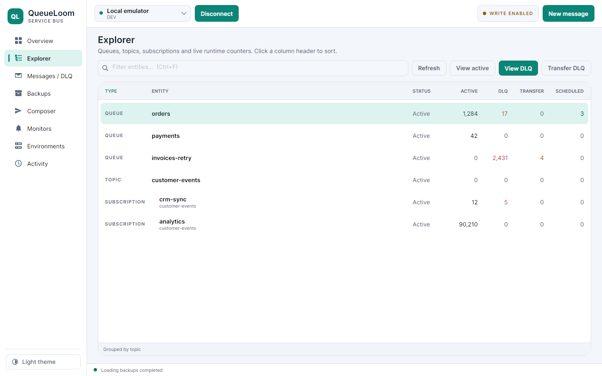
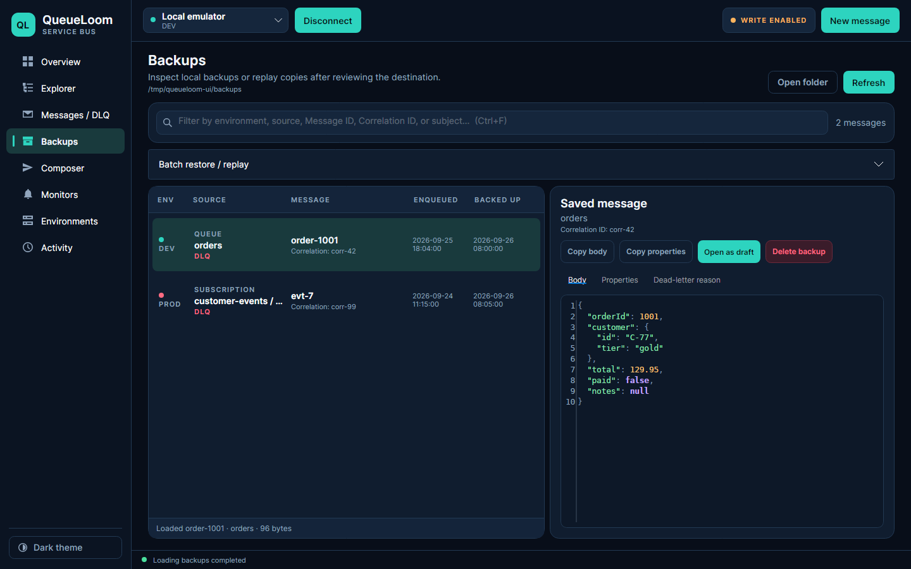
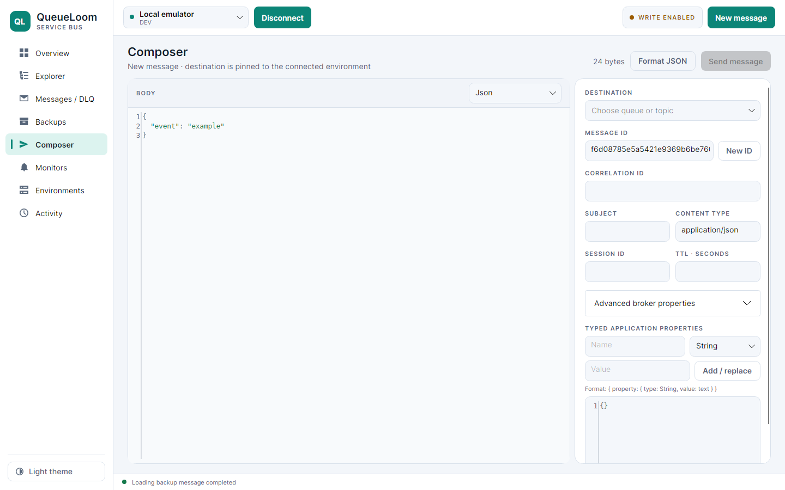

# QueueLoom

Desktop client for Azure Service Bus: browse queues, topics and subscriptions, find dead-letter messages, and back them up, delete, replay or resend them. AI assistants can use it too, through MCP.


<table>
  <tr>
    <td></td>
    <td></td>
    <td></td>
  </tr>
  <tr>
    <td align="center">Explorer (light theme)</td>
    <td align="center">Backups</td>
    <td align="center">Composer</td>
  </tr>
</table>

## Install

Download `QueueLoom-<version>-win-x64.zip` from [Releases](../../releases), extract it and run `QueueLoom.exe`. No .NET installation is needed. The `.sha256` file next to the ZIP lets you verify the download.

## Quick start

1. **Environments** → **Add environment**: enter a namespace connection string or use Microsoft Entra ID.
2. Pick the environment in the top bar and press **Connect**.
3. **Explorer** lists queues, topics and subscriptions with live counters. Select one and press **View active** or **View DLQ**. Peek never locks or removes messages.

Production environments are read-only by default, and you can make any environment read-only in its settings. Anything that changes Service Bus in a read-only environment needs **Unlock 10 min** in the top bar first.

## Pages

| Page | Use it to |
|---|---|
| Overview | See totals for the connected namespace and the latest dead-letter scan. |
| Explorer | Filter and sort entities, and open active, DLQ or transfer DLQ messages. |
| Messages / DLQ | Search dead letters, inspect a message, delete selected messages, or back up and purge a whole source. |
| Backups | Browse local backups, and restore or replay them to a queue or topic. |
| Composer | Write and send a message: body (text, JSON or Base64), broker properties and typed application properties. |
| Monitors | Poll dead-letter counts every N seconds while the app is open and list new arrivals. |
| Environments | Add, edit and delete saved namespaces. |
| Activity | Review the local history of connections, scans, sends, deletions and errors. |

## Common tasks

**Find and delete specific dead-letter messages**
1. On **Messages / DLQ**, type a Correlation ID, Message ID, subject, body text or property value and press Enter.
2. Tick the messages to remove. The box in the table header ticks all of them.
3. Press **Delete N messages…** and confirm.

Each ticked message is saved to a local backup and then deleted; every other message stays in the queue. Messages that are already gone are reported and left ticked.

**Empty a dead-letter queue**
1. On **Messages / DLQ**, press **Scan current environment** and select a source.
2. Open **Backup and purge…** and set the per-source limit.
3. Choose the source, topic or environment purge.

Every message is backed up before it is deleted.

**Resend a dead letter**
1. Select the message and press **Open as draft**.
2. Edit the copy in **Composer** if needed and press **Send message**.

The original message is not changed.

**Restore from a backup**: on **Backups**, filter the list, open **Batch restore / replay**, choose a destination and a rate, then **Restore filtered backups…**.

## Keyboard and mouse

| Shortcut | Action |
|---|---|
| Ctrl+1 … Ctrl+8 | Go to Overview, Explorer, Messages / DLQ, Backups, Composer, Monitors, Environments, Activity |
| Ctrl+F | Focus the search or filter box of the current page |
| Enter (in the DLQ search box) | Search dead letters |
| Ctrl+R | Refresh topology and counters |
| Ctrl+N | New message in Composer |
| Ctrl+Shift+F | Format the JSON body; on a syntax error, jump to that line |
| Esc | Cancel the running operation |

| Mouse | Action |
|---|---|
| Click a column header in Explorer | Sort by that column (again to reverse); **TYPE** restores the topic grouping |
| Double-click an entity name in Explorer | Copy the name |
| Right-click a row | Copy menu: entity or topic name in Explorer, DLQ sources and Monitors; Message ID or Correlation ID in the message list; details in Activity |
| Checkbox in the message list header | Tick or untick all dead-letter messages |
| Theme button (bottom of the sidebar) | Switch between dark, light and system theme |

Hover over a sidebar item or a button to see its shortcut.

## AI assistants (MCP)

`QueueLoom.exe --mcp` runs QueueLoom as a [Model Context Protocol](https://modelcontextprotocol.io) server, so Claude, Cursor, VS Code Copilot and other MCP clients can work with your saved environments. The assistant uses the same profiles, encrypted credentials, backups and activity log as the app.

| Tool | What it does | Approval |
|---|---|---|
| `list_environments` | Saved environments and their kind (e.g. Production) | — |
| `get_entities` | Queues, topics and subscriptions with message counts | — |
| `scan_dead_letters` | Non-empty dead-letter queues | — |
| `peek_messages` | Messages with body and properties, without locking them | — |
| `search_dead_letters` | Dead letters containing a text | — |
| `delete_dead_letter_messages` | Back up and delete exactly the listed dead letters | **required** |
| `purge_dead_letters` | Back up and delete up to N messages from one dead-letter queue | **required** |
| `send_message` | Send a message to a queue or topic | **required** |

Reading is always allowed and never locks or removes messages. For every change, QueueLoom opens this window on your desktop and waits up to 5 minutes. The assistant cannot press the buttons; production environments also ask you to type the environment name:


> Message bodies and properties that the assistant reads are sent to your AI provider like any other chat content. Message text can also contain instructions aimed at the model; this is one reason every change needs your approval. Use `--read-only` or a read-only environment for namespaces whose data must not leave your machine.

Approved changes get the same safeguards as in the app: a local backup before every deletion, and an entry in **Activity** marked `MCP`. Without a desktop session (for example over SSH on Linux), QueueLoom asks through the client's own approval prompt (MCP elicitation) and refuses the change if the client has none.

**Set up.** **Overview → AI assistants (MCP) → Copy configuration** copies an entry with the correct path. For example, in Claude Desktop (**Settings → Developer → Edit Config**) or Cursor (`~/.cursor/mcp.json`):

```json
{
  "mcpServers": {
    "queueloom": {
      "command": "C:\\Tools\\QueueLoom\\QueueLoom.exe",
      "args": ["--mcp"]
    }
  }
}
```

- **Claude Code:** `claude mcp add queueloom -- "C:\Tools\QueueLoom\QueueLoom.exe" --mcp`
- **VS Code** (`.vscode/mcp.json`): use `"servers"` instead of `"mcpServers"` and add `"type": "stdio"`.
- **Read-only:** add `"--read-only"` to `args` and the change tools are not offered at all.

Then ask, for example: *"Which queues in Staging have dead letters? Find the ones mentioning order 1042 and delete them."* The assistant searches on its own, and QueueLoom asks you before deleting.

## Safety

- **Read-only environments stay read-only** until you press **Unlock 10 min**. The unlock applies only to the connected environment; production asks you to type its name.
- **Nothing is deleted without a backup.** Purges and selective deletes write each message to a local JSON file first. The confirmation lists the environment, the queues and the count.
- **Peek and scans never settle messages.** Search, browse and monitoring only read.
- **AI assistants need your approval for every change** in a QueueLoom window (see above).
- **Replay sends copies.** The original messages and backups stay unchanged, and uncertain deliveries are flagged instead of retried.

## Data and limits

| | |
|---|---|
| Data folder | `%LOCALAPPDATA%\QueueLoom`: settings, encrypted connection strings, backups, the activity journal and `logs\queueloom-yyyyMMdd.log`. Logs are kept 14 days, with credentials redacted. |
| Override | `QUEUELOOM_DATA_DIRECTORY`, `QUEUELOOM_BACKUP_DIRECTORY` |
| Backups | Contain message bodies in plain text or Base64; protect the folder accordingly. |
| Peek | Up to 1,000 messages or 32 MiB of bodies per list. |
| Selective delete | Up to 1,000 messages at a time; searches the first 5,000 messages of each dead-letter queue. |
| Monitor | Runs only while QueueLoom is open; the minimum interval is 15 seconds. |
| Not supported | Session-enabled entities, and creating or editing queues and topics. |
| Emulator | Counts are sampled; the transfer DLQ is unavailable. See the [emulator lab](dev/emulator/README.md). |

The Windows package is unsigned. Failure scenarios against real Azure are not fully tested yet.

## Development

Requires the .NET 10 SDK.

```powershell
dotnet restore QueueLoom.slnx
dotnet test QueueLoom.slnx -c Release      # unit tests and headless UI tests
dotnet publish src/QueueLoom.App/QueueLoom.App.csproj -p:PublishProfile=win-x64-single-file -o artifacts/publish
```

Set `QUEUELOOM_SCREENSHOT_DIR` before `dotnet test` to save screenshots of every page in both themes (the images above come from there).

The MCP tools live in `src/QueueLoom.Mcp`; `tests/QueueLoom.Tests/McpServerTests.cs` drives them with a real MCP client, and `McpProcessTests.cs` starts `QueueLoom --mcp` over stdio.

**Releases are automatic.** Every merge to `main` is tested, built and published as the next version, taken from the latest `vX.Y.Z` tag:

| First line of the merge commit contains | Result |
|---|---|
| nothing special | patch release, e.g. 1.2.0 → 1.2.1 |
| `[minor]` | 1.2.0 → 1.3.0 |
| `[major]` | 1.2.0 → 2.0.0 |
| `[skip release]` | no release |

With a squash merge, the first line is the pull request title; for a single-commit pull request GitHub proposes the commit subject instead, so check it in the merge dialog. Merges that only change Markdown, `LICENSE` or `dev/` do not release. **Actions → CI → Run workflow** on `main` releases on demand. Push a tag such as `v1.3.0-rc.1` for a pre-release.

[MIT License](LICENSE) · [Third-party notices](THIRD-PARTY-NOTICES.md)
